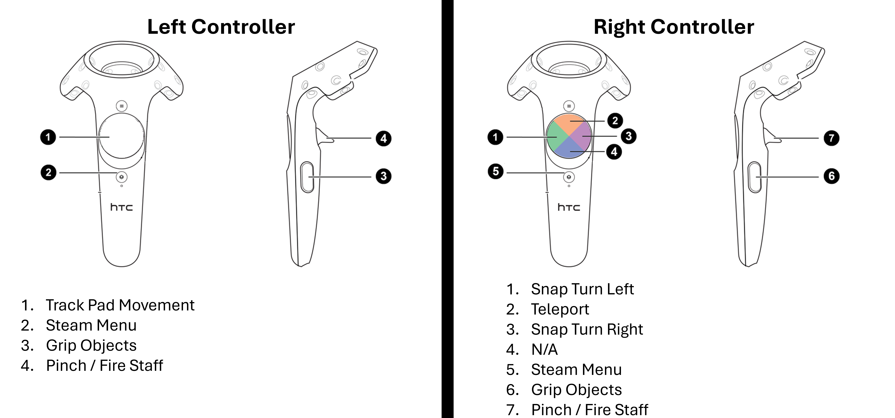

  

 
 

Set in a magical fantasy world, you awaken inside a mysterious wizard’s tower as goblins prepare to attack. Guided by a talking crow, you must solve puzzles to assemble a powerful magic staff before the goblins break in. Once complete, the staff becomes your only hope for survival. Defeat the goblins or perish...

 
 

⚡ Build your power, defy the odds, and face the horde! ⚡

 

    <a href="https://drive.google.com/drive/folders/141nkooyf4jXhO3puiDnCheEiSxXfYKXD?usp=sharing" target="_blank" style="text-decoration: none; font-weight: bold; color: #00c0f0;">Download</a>

 

## Building Stages

1. Collect the Staff Base and place it on the roundtable.  
2. Smash the glass pig to obtain the Staff Grip. Attach Grip to the Staff Base.    
3. Solve a simple rune puzzle by selecting runes in the correct order. Obtain a Staff Head that needs to be twisted into the Staff Grip.    
4. Look in the recipe book and drop ingredients into a cauldron. Stir the cauldron and insert the Staff Core into the Staff.    
5. Place staff on a pedestal and calibrate it by drawing symbols pertaining to your chosen element.    
6. Fight the goblins that spawn at a nearby portal by casting your chosen element's Staff attack and exit through the portal once all waves have been defeated.  

## Controls

  

## Scripts 📜
Most of the scripts used within the game were written ourselves. A youtube tutorial was only used for the Drawing Recognition where the code was built upon to add extra needed functionality.  

All of the VR interactions were handled by the Unity XR interaction toolkit which allowed player interactions within the environment.   

Many of the scripts included in this toolkit were used such as XRGrabbable.cs for grabbing objects and XRKnob.cs for the twisting of the staff head.

For the smashing of the glass pig, the assets and scripts were taken from the default unity XR example prefab and modified.

### Drawing Recognition
https://www.youtube.com/watch?v=GRSOrkmasMM  
https://www.youtube.com/watch?v=kfA_73npjMA&t=876s  

Due to the outdated nature of the code, many changes had to be made to to the MovementRecognizer.cs script for it to work with the new Unity Engine versions.
The script was also appended to account for the different core elements and their varying symbols. 

### Other Scipts
All scripts can be found in Assets/Scripts/

| Script       | Purpose                  |       
|:-------------|:-----------------------------
| CoreGestureMaterialController.cs | Tracks player gestures for each magical core, updating materials and triggering effects when a core is fully calibrated. 
| Player.cs  | Handles the player’s VR interactions, including health, core-based attacks, spell casting, and haptic feedback for each hand.        
| RuneButton.cs  | Handles individual rune interactions in a puzzle, managing glow effects, XR selection events, and communicating presses to the puzzle manager.
| RunePuzzleManger.cs  | Manages the rune puzzle sequence by tracking player presses, highlighting ceiling indicators, and triggering audio and chest animations upon correct completion.
| KnobTrigger.cs | Triggers effects and activates or disables objects when an XR knob reaches its maximum value, optionally allowing reset if turned back.
| HapticOnObjectHit.cs | Provides haptic feedback to VR controllers when the object collides with something, scaling intensity and duration based on impact strength.
| Goblin.cs  | Controls goblin behavior, including navigation toward the player, attacking, taking damage, dying, and handling frozen or active states in the game.
| EnemySpawner.cs  | Spawns waves of goblins at designated points, manages wave progression, enables delayed audio, and triggers game completion when all waves are defeated and the player reaches the portal.
| AttackSound.cs | Plays a random attack sound from a list whenever the associated animation state is entered.
| controller.cs  | Handles the page turning interaction with the recipe book.

## Assets used

Most assets were acquired off the unity asset store with the exception being that of the the many FX.  

The following Synty Pack was used for most FX used throughout the experience:  

https://syntystore.com/products/polygon-particle-fx-pack (Purchased from Humble Bundle for $1 in March 2025)

## Source Files

Source files can be found [here](https://gitlab.cs.uct.ac.za/mdlmah007/tower-of-creation) hosted on the UCT CS Gitlab servers.

## Build executable

The windows build can be downloaded from [here](https://drive.google.com/drive/folders/141nkooyf4jXhO3puiDnCheEiSxXfYKXD?usp=sharing).
- Be sure to download the entire "TOC Build" folder
- The Windows executable is located in the "TOC Build" folder and called "TowerOfCreationFinal.exe"
  - Launch it to play the game. 
- Make sure SteamVR is running before launching!
  
## Developers 

- [Ibrahim Abdou](https://github.com/IbrahAbd)
- [Zahra Bawa](https://github.com/LokiDoki-Z)
- [Mahir Moodaley](https://github.com/MrMoodles123)

